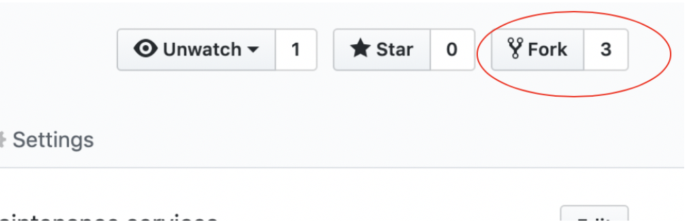
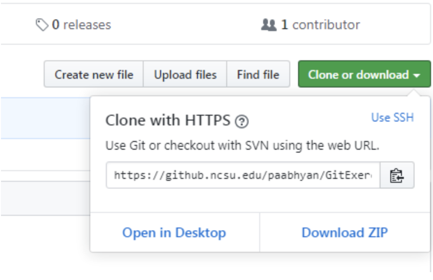
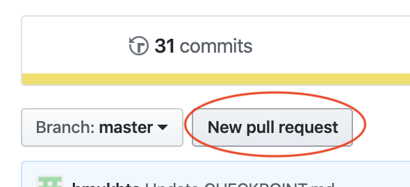

# GitPractice
Temporary Repository designed to accompany Assignment0 and allow students to practice using git commands and creating pull requests. Below are a reminder of the instructions included in the assignment for interacting this repository.
___
**Putting git commands into practice** :
1. Visit the [GitPractice](insertlink) repository.
2. Fork the repository.
	
3. Clone your forked repository using the HTTPS clone url and create a branch.
	
```Bash
git clone [https_url]
git branch // list branches
git checkout -b [unityId] // create new branch from the current HEAD
git branch
git checkout [unityId] // switch to that branch
```
4. Add a new .txt file with your unity id as the file name (eg. paabhyan.txt).
5. Add content to the new .txt file that gives a brief introduction of who you are and your background. This can simply be a few sentences.
6. Stage and commit this change.
```Bash
git status // check changes currently staged
git add [filename] // stage changes
git status // check that change was staged
git commit -m “Commit message”
git push origin [unityId] // push branch changes to forked repo
```
7. Create a pull request. We suggest that you use the GitHub UI to do this. 


_This request will notify the repository owner of your requested change. He/She will then review the change and either approve or deny the merge._
